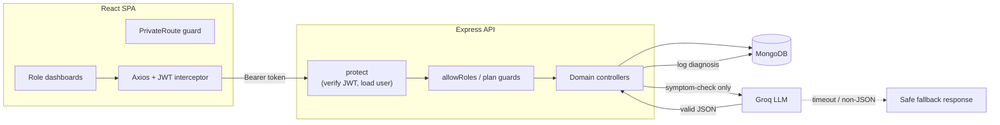
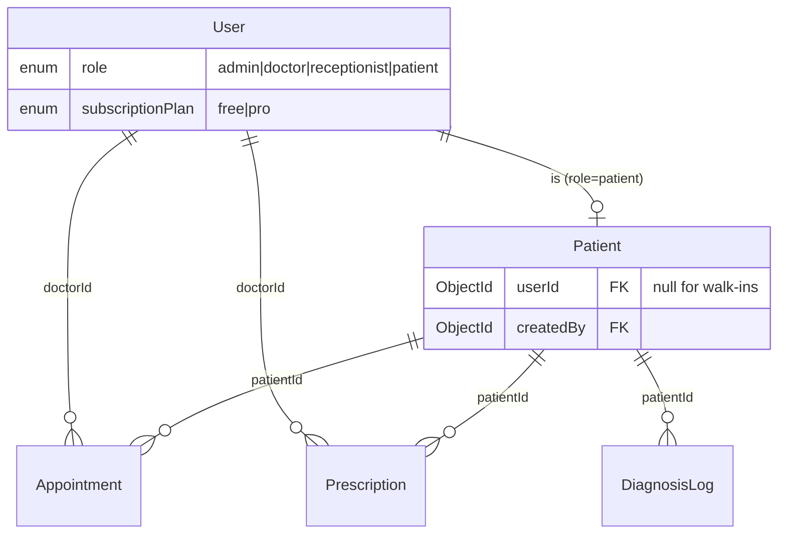

# Case Study — ClinicAI: Clinic Management & Smart Diagnosis SaaS

## Project Overview

| | |
| --- | --- |
| **Project Name** | ClinicAI |
| **One-liner** | A single system where a clinic's four roles — admin, doctor, receptionist, patient — share one source of truth, with an LLM symptom checker that converts free-text complaints into structured, risk-rated diagnostic suggestions. |
| **GitHub** | _<add your repo URL>_ |
| **Live Demo** | https://clinic-management-system-v5je.vercel.app/ |
| **Team Size** | Solo |
| **Role** | Full-stack (MERN) + AI integration |
| **Timeline** | Hackathon build (part-time) |

The problem ClinicAI targets is coordination, not record-keeping. A small clinic already "has the data" — it's just scattered across a receptionist's notebook, a doctor's memory, and a patient's WhatsApp chat. When those three views disagree, appointments get double-booked, prescriptions get lost, and the patient re-tells their history at every visit. ClinicAI puts all four roles on one dataset with server-enforced boundaries, then adds an AI layer that gives doctors a fast second opinion and gives Pro patients a preliminary self-checkup.

---

## Goals

### What We Built
- **One dataset, four role-scoped views.** A receptionist, doctor, patient, and admin all read/write the same patients and appointments, but each sees only what their role permits — enforced at the API, not just hidden in the UI.
- **An AI symptom checker that fails safe.** Doctors (and Pro patients) submit symptoms and receive structured JSON — possible conditions, risk level, suggested tests, advice — that is rendered as UI and logged for the patient's history. A flaky or unreachable LLM must never break the clinical workflow.
- **A real subscription boundary.** The Pro plan is not cosmetic: it unlocks the patient AI Checkup, gated in both the UI and the API.

### Technical Goals
- Stateless auth that carries role, so horizontal scaling needs no sticky sessions.
- Cross-collection reads (a patient's full history) assembled without N+1 query storms.
- Graceful degradation of the AI feature: a bad LLM response returns a safe fallback, never a `500`.

### Non-Goals (Scope Boundaries)
- **No real payments.** Plan upgrades are instant and free — this is a simulated SaaS boundary for the demo, so we skipped Stripe/PCI entirely and focused engineering effort on the entitlement logic itself.
- **No concurrency control on booking.** Two receptionists could theoretically book the same doctor/slot. Accepted for a single-clinic MVP where booking contention is near zero; called out below as a known trade-off.
- **No native mobile app.** The dashboards are responsive web; clinic staff work at a desk.
- **No refresh-token rotation.** A 30-day JWT is acceptable for a demo; production would shorten access tokens and add rotation.

---

## System Architecture

### Tech Stack

| Layer | Technology | Why This Choice | What We Considered |
| --- | --- | --- | --- |
| Frontend | React 19 + Vite 8 | Small role-routed SPA; Vite's HMR keeps the multi-dashboard build loop fast | CRA (slower, deprecated), Next.js (SSR unnecessary — this is a gated internal tool with no SEO surface) |
| Routing | React Router 7 | Nested role routes (`/admin/*`, `/doctor/*`, …) behind a single guard component | File-based routing (overkill for ~6 routes) |
| Styling | Tailwind 4 + hand-authored design tokens | Tailwind for layout speed; a small `ui-*` class system for the dark clinical theme so every page stays visually consistent | Component library like MUI (heavy, opinionated, hard to theme to a custom clinical look) |
| Backend | Node.js + Express 4 | Minimal REST surface, same language as the frontend, trivial to deploy serverless | NestJS (structure we didn't need), Django (would add a second language) |
| Database | MongoDB + Mongoose 8 | Medical records vary in shape (a prescription has an array of medicine sub-docs); `populate` cleanly resolves the doctor/patient references | PostgreSQL (stronger integrity, but the join-heavy relational modeling wasn't worth it at this scale) |
| Auth | JWT + bcryptjs | Stateless token carrying `role` → no per-request session store; bcrypt for password hashing | Session cookies + Redis (adds infra and sticky-session complexity for no benefit here) |
| AI | Groq SDK — `llama-3.3-70b-versatile` | Very low inference latency, which matters for an in-visit tool a doctor uses live | OpenAI (higher latency/cost for this use), a local model (ops burden) |
| Deploy | Vercel (API + web) / Netlify (web) | Zero-config: static SPA + a serverless Express handler | A single VPS (more control, more ops for a hackathon) |

### Architecture Diagram



The failure boundary that matters here is the dashed edge: the LLM is the one dependency we don't control, so it is the one call wrapped in a fallback. Everything else is a straightforward authenticated CRUD path.

---

## Key Features

### Authentication & Role-Based Access Control
- **JWT with an embedded `role` claim.** The token carries the role, so `allowRoles(...)` can authorize without a second DB round-trip beyond the `protect` user load. Chosen over sessions to keep the API stateless and deployable as a serverless function.
- **Guarded at the API layer, mirrored in the UI.** `PrivateRoute` redirects the wrong role in the browser, but the real enforcement is server-side middleware — a receptionist's token cannot hit a doctor-only endpoint even with a crafted request.
- **Dual patient identity.** Registering as a patient creates *both* a `User` (login) and a linked `Patient` (clinical record). Receptionists can also create `Patient` records with no login (`userId: null`) for walk-ins.

### Appointments (role-scoped)
- `GET /api/appointments` returns a different set per role: a doctor sees appointments where `doctorId` is them; a patient sees only appointments tied to their own `Patient` record (resolved via `Patient.userId`); admins/receptionists see all. The scoping lives in the controller, so no client can widen its own view.
- Status is a small state machine (`pending → confirmed → completed`, or `cancelled`), with transitions restricted to doctors/admins.

### AI Diagnosis / Checkup
- A single endpoint serves two audiences with one prompt that adapts: doctors get clinician-facing advice; Pro patients get plain-language, "see-a-doctor-when-appropriate" advice.
- Every run is written to `DiagnosisLog`, which then appears in that patient's history timeline — the AI isn't a dead-end widget, it feeds the record.

### Patient History Timeline
- `GET /api/patients/:id/timeline` fans out three parallel queries (appointments, prescriptions, diagnosis logs), `populate`s the doctor on each, and returns them together; the client merges and sorts them into one reverse-chronological stream.

---

## API Design

Endpoints are grouped by domain, and the interesting ones carry non-obvious rules:

```
# Auth
POST /api/auth/register        # role=patient also auto-creates a linked Patient
POST /api/auth/login           # returns JWT with role claim
PUT  /api/auth/users/:id/plan  # guarded: self OR admin (not admin-only)

# Patients   (note: /my declared BEFORE /:id)
GET  /api/patients/my          # patient's own record, matched by userId
GET  /api/patients/:id/timeline# merged history across 3 collections

# Appointments
GET  /api/appointments         # response is role-scoped in the controller
PUT  /api/appointments/:id/status  # doctor/admin only, state-machine transition

# AI
POST /api/ai/symptom-check     # allowRoles(doctor, patient) THEN requireProForPatients
```

The `/my`-before-`/:id` ordering is a deliberate Express detail: route matching is top-down, so a literal `/my` must be registered before the `/:id` wildcard or Express treats `"my"` as an id.

---

## Database Design



**Key decision — the User/Patient split.** The single most consequential modeling choice was separating login identity (`User`) from clinical identity (`Patient`). A patient who self-registers needs both; a walk-in registered by reception needs only a `Patient`. Linking them by `Patient.userId` (nullable) supports both cases from one schema. The trade-off is a small denormalization — the patient's name lives on both documents — accepted because a name rarely changes and it avoids a join on every patient-facing read.

---

## Challenges and Solutions

| # | Challenge | Why It Was Hard | Solution | Trade-off |
| - | --- | --- | --- | --- |
| 1 | **Pro-gating the AI Checkup end to end** | Hiding the tab in the UI is trivial and worthless — a free patient could still `POST` the AI endpoint directly | Two-layer gate: UI shows an upgrade screen; API runs `allowRoles("doctor","patient")` then a `requireProForPatients` guard returning `403` | Plan checks are coarse (route-level), not a granular entitlement system |
| 2 | **Patients couldn't upgrade themselves** | The plan-change route was `allowRoles("admin")`, so the "Upgrade to Pro" button hit a `403` — the whole Pro feature was unreachable for the exact users it was for | Replaced with a `selfOrAdmin` guard: a user may change *their own* plan, an admin may change anyone's | A patient can toggle their own plan freely (fine for a no-payment demo; a real billing flow would own this) |
| 3 | **The API wouldn't boot at all** | `authRoutes.js` called `allowRoles(...)` but the `require` destructured only `{ protect }` — a `ReferenceError` at module load crashed the entire server, not just one route | Added `allowRoles` to the import; verified the server boots and every router mounts | None — this was a latent crash, now fixed |
| 4 | **The LLM returns "almost JSON"** | `llama-3.3` wraps its JSON in \`\`\`json fences and occasionally drifts; a naive `JSON.parse` throws and would 500 a doctor mid-visit | Strip code fences, `JSON.parse`, and wrap the whole call in try/catch that returns a structured **fallback** ("consult manually") with a `fallback: true` flag the UI renders calmly | The doctor sometimes sees a graceful "AI unavailable" card instead of a result — correct behavior, but it means the feature's usefulness depends on LLM availability |
| 5 | **Each role must see a different slice of the same collection** | A single `GET /appointments` has to mean "mine" for a doctor, "mine" for a patient, and "all" for admin — and it must be impossible to widen from the client | Branch the Mongoose query by `req.user.role` in the controller; for patients, resolve their `Patient._id` via `userId` first | A patient with no `Patient` record (misconfigured) simply sees an empty list rather than an error |
| 6 | **Assembling a patient's history across three collections** | Appointments, prescriptions, and AI diagnoses live in separate collections with different timestamps and shapes | Three parallel `Promise.all` queries with `populate`, returned together and merged/sorted on the client into one timeline | Merge/sort happens client-side; fine for one patient's history, would need pagination for very long records |
| 7 | **The UI was visually broken across pages** | Half the pages were light-theme Tailwind cards sitting inside a dark app shell — inconsistent and unpolished | Extracted a shared design system (CSS tokens + `ui-*` component classes), then converted each page one at a time, keeping all logic untouched | A one-time, wide-reaching refactor; mitigated by converting page-by-page and rebuilding after each |
| 8 | **Couldn't screenshot to verify the redesign** | The preview tooling's screenshot step timed out in this environment, so visual QA by eye wasn't possible | Verified via DOM/computed-style inspection and the accessibility tree: asserted background colors, SVG icon counts, "zero emoji in main", and per-role element presence | Slower, more mechanical verification than eyeballing — but deterministic and scriptable |

### Deep Dive: Making the Pro Boundary Real (challenges 1–2)

**The problem.** The subscription started as decoration — a `free`/`pro` field that changed a badge and nothing else. The goal was to make Pro *mean* something: a patient-facing AI Checkup that only Pro patients can use. The obvious first move — add an "AI Checkup" tab and hide it for free users — is exactly the wrong instinct, because the browser is not a security boundary. Anyone could read the network calls and `POST /api/ai/symptom-check` directly.

**Investigation.** Wiring the feature surfaced a second, sneakier bug. The plan-change endpoint was `allowRoles("admin")` — a sensible-looking default from when only admins managed accounts. But the entire point of a self-serve Pro upgrade is that the *patient* initiates it. So the upgrade button called an endpoint that structurally rejected the caller: `403`. The feature was unreachable for its own audience, and nothing in the UI made the cause obvious.

**Solution.** I enforced the boundary in two places and fixed the authorization to match the real actor:

```js
// backend/routes/aiRoutes.js — the server is the authority
const requireProForPatients = (req, res, next) => {
  if (req.user.role === "patient" && req.user.subscriptionPlan !== "pro") {
    return res.status(403).json({ message: "Upgrade to Pro to access AI checkups." });
  }
  next();
};
router.post("/symptom-check", protect, allowRoles("doctor", "patient"), requireProForPatients, symptomCheck);

// backend/routes/authRoutes.js — let a user change their own plan
const selfOrAdmin = (req, res, next) => {
  if (req.user.role !== "admin" && req.user._id.toString() !== req.params.id) {
    return res.status(403).json({ message: "You can only change your own plan." });
  }
  next();
};
router.put("/users/:id/plan", protect, selfOrAdmin, updateUserPlan);
```

The UI still gates the tab — but only as UX, not security. Doctors bypass the plan check entirely (they're not patients).

**Result.** Verified the full matrix against the running API:

| Actor | Action | Result |
| --- | --- | --- |
| Free patient | `POST /ai/symptom-check` | `403 "Upgrade to Pro to access AI checkups."` |
| Free patient | Upgrade own plan | `200`, plan → `pro` |
| Pro patient | `POST /ai/symptom-check` | `200` |
| Doctor (any plan) | `POST /ai/symptom-check` | `200` |
| Patient | Change *another* user's plan | `403` |

The boundary now holds even if someone bypasses the UI entirely — which is the only definition of "gated" that counts.

---

## Best Practices Applied

**Security**
- Passwords hashed with bcrypt via a Mongoose `pre("save")` hook — plaintext never persists.
- Authorization enforced server-side with composable middleware (`protect` → `allowRoles` / plan guards), not in the UI.
- JWT secret and DB/LLM credentials read from environment variables, never committed.
- CORS is allow-listed to specific deployed origins (plus `*.vercel.app` / `*.netlify.app`), not `*`.

**Reliability**
- The one uncontrolled dependency (the LLM) is wrapped in a fallback so it can never `500` a user flow.
- A global Express error handler and a `404` catch-all keep unexpected failures structured as JSON.

**Frontend**
- A single Axios instance with a request interceptor attaches the token everywhere — no per-call auth wiring.
- A shared design-token + `ui-*` class system keeps every dashboard visually consistent and made the page-by-page redesign safe.
- SVG icon set replaced ad-hoc emoji for a consistent, scalable visual language.

**Verification**
- The client production build (`vite build`) is the compile-time gate — run after each page conversion.
- End-to-end behavior verified against the live API (the auth matrix above) and via DOM/computed-style assertions per role.

---

## Results and Metrics

> These are build-time and functional-verification metrics from development, not production load-test numbers — stated plainly so they're not mistaken for traffic data.

| Metric | Value | How Measured |
| --- | --- | --- |
| Production build | 649 modules, ~735 KB bundle (~213 KB gzip) | `vite build` output |
| Build time | ~8–23 s | `vite build` |
| Auth/plan matrix | 5/5 cases pass (see deep dive) | Live requests against the running API |
| Role dashboards | 4/4 render with **zero** UI console errors | Preview console inspection per role |
| AI failure handling | Graceful fallback verified when Groq unavailable | Forced-failure path returns `fallback: true`, UI renders it |

---

## Learnings and Next Steps

### What Went Well
- **Enforcing authorization in middleware, not controllers,** kept the rules composable — gating the AI route for Pro patients was one small guard slotted into the chain, not a rewrite.
- **Splitting login identity from clinical identity** paid off immediately: it made walk-in patients and self-registered patients the same code path with one nullable link.

### What I'd Do Differently
- **Model entitlements, not just a plan string.** A `subscriptionPlan: "pro"` field answered "can they use AI?" but won't scale to a second or third gated feature. I'd introduce an explicit feature/entitlement check so new Pro features don't each hand-roll a plan comparison.
- **Add optimistic concurrency to booking before multi-clinic.** Today two bookings can collide. A `version` field (or a unique index on doctor+slot) would prevent double-booking; I deferred it deliberately for a single-clinic MVP, but it's the first thing I'd add for real use.
- **Shorten the JWT and add refresh rotation.** A 30-day token is a demo convenience; production wants short access tokens with rotating refresh tokens in HttpOnly cookies.

### Future Roadmap
- **Entitlement service** so Pro can unlock multiple features cleanly (highest leverage — it unblocks everything else).
- **Booking concurrency control** (unique doctor+slot index) to eliminate double-booking.
- **Structured LLM output via function/JSON mode** to reduce the fallback rate instead of string-stripping fences.
- **Audit log** on record changes — a clinical system should be able to answer "who changed this, and when."
