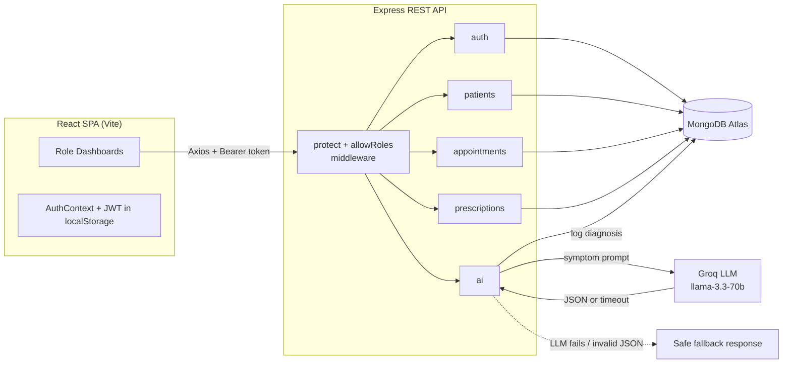
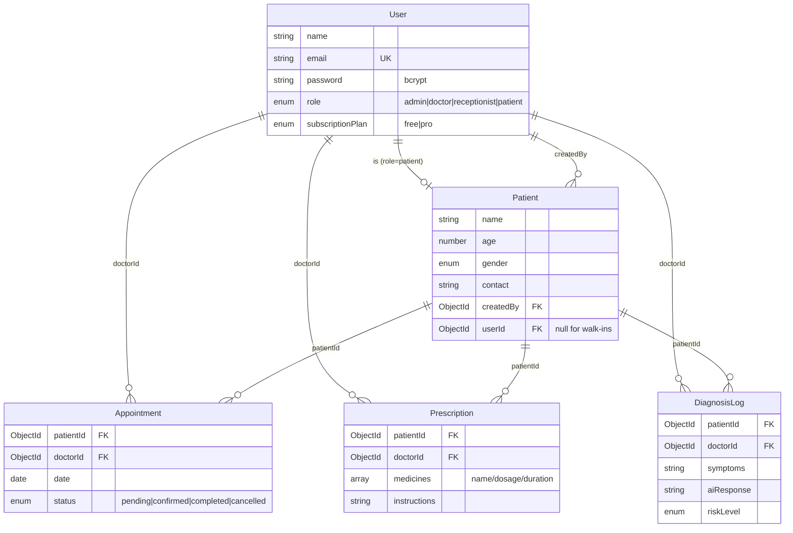

# ClinicAI — Clinic Management & Smart Diagnosis SaaS

> A role-based clinic operations platform where admins, doctors, receptionists, and patients share one system — with an AI symptom checker that turns free-text complaints into structured, risk-rated diagnostic suggestions.

ClinicAI replaces the paper-and-WhatsApp workflow of a small clinic with a single web app. Receptionists register patients and book appointments, doctors confirm visits and write prescriptions, patients view their records and (on the Pro plan) run an AI health checkup, and admins see the whole operation with live analytics.

---

## Table of Contents

- [Live Demo & Accounts](#live-demo--accounts)
- [Features by Role](#features-by-role)
- [Tech Stack](#tech-stack)
- [Architecture](#architecture)
- [Project Structure](#project-structure)
- [Getting Started](#getting-started)
- [Environment Variables](#environment-variables)
- [API Reference](#api-reference)
- [Data Models](#data-models)
- [Subscription Gating (AI Checkup)](#subscription-gating-ai-checkup)
- [Deployment](#deployment)

---

## Live Demo & Accounts

| | |
| --- | --- |
| **Frontend** | Deployed on Vercel | https://clinic-management-system-v5je.vercel.app/login |
| **Backend** | Express API on Vercel (`backend/vercel.json`) |

**Demo credentials** (seeded in the database):

| Role | Email | Password |
| --- | --- | --- |
| Admin | `ali@test.com` | `123456` |
| Doctor | `doctor@test.com` | `123456` |
| Receptionist | `sara@test.com` | `123456` |
| Patient | `patient@test.com` | `123456` |

New patients can self-register from the app; staff accounts (doctor / receptionist / admin) are created by an admin from the **Add Staff** tab.

---

## Features by Role

### Admin
- System overview: total patients, doctors, appointments, completions
- All patients and all appointments tables
- **Add Staff** — create doctor / receptionist / admin accounts
- **Analytics** — appointments by month, appointment-status breakdown, user-role split, and patient-gender distribution (Recharts)

### Doctor
- Appointment queue with one-click status transitions (pending → confirmed → completed)
- Multi-medicine prescription writer with dosage / duration
- **AI Diagnosis** — enter symptoms and get possible conditions, risk level, suggested tests, and advice
- Per-patient medical-history **timeline** merging appointments, prescriptions, and past AI diagnoses

### Receptionist
- Register and edit patient records (name, age, gender, contact)
- Book appointments between a patient and a doctor
- Cancel pending/confirmed appointments

### Patient
- Personal overview with recent appointments and prescriptions
- Book an appointment with any doctor
- View and print/download prescriptions
- **AI Checkup** (Pro plan) — a patient-facing symptom checker
- Upgrade to Pro from the in-app Plans page

---

## Tech Stack

| Layer | Technology | Why |
| --- | --- | --- |
| Frontend | **React 19 + Vite 8** | Fast HMR dev loop; React 19 for a small SPA with role-based routing |
| Routing | **React Router 7** | Nested role routes (`/admin/*`, `/doctor/*`, …) behind a guard |
| Styling | **Tailwind CSS 4** + a shared CSS design system | Utility classes for layout, hand-authored tokens for the dark clinical theme |
| Charts | **Recharts** | Declarative bar/pie charts for the admin analytics tab |
| HTTP | **Axios** | Request interceptor injects the JWT on every call |
| Backend | **Node.js + Express 4** | Small, well-understood REST surface; shared JS language with the frontend |
| Database | **MongoDB + Mongoose 8** | Flexible documents for varied medical records; `populate` for cross-collection reads |
| Auth | **JWT (jsonwebtoken) + bcryptjs** | Stateless 30-day tokens carrying the user's role; bcrypt-hashed passwords |
| AI | **Groq SDK** (`llama-3.3-70b-versatile`) | Fast, low-latency LLM inference for the symptom checker |
| Deploy | **Vercel** (API + web) / **Netlify** (web) | Zero-config deploys for a Vite SPA and a serverless Express handler |

---

## Architecture



Every protected request passes through `protect` (verifies the JWT, loads the user) and, where needed, `allowRoles(...)` (rejects the wrong role with `403`). The AI route additionally checks the caller's subscription plan before spending an LLM call. If Groq is unreachable or returns unparseable JSON, the controller returns a safe fallback so the doctor's or patient's workflow never breaks.

---

## Project Structure

```
saylani-final-hackathon/
├── backend/
│   ├── config/db.js                  # Mongoose connection
│   ├── controllers/                  # auth, patient, appointment, prescription, ai
│   ├── middleware/authMiddleware.js  # protect + allowRoles
│   ├── models/                       # User, Patient, Appointment, Prescription, DiagnosisLog
│   ├── routes/                       # one router per domain
│   └── server.js                     # app entry, CORS, route mounting
└── client/
    ├── index.html
    └── src/
        ├── components/
        │   ├── PrivateRoute.jsx      # auth + role guard
        │   └── shared/               # Layout, SideBar, Icon, StatCard
        ├── context/                  # AuthContext, useAuth
        ├── pages/                    # Login, Register, plans, admin, doctor, receptionist, patient
        ├── services/api.js           # Axios instance + interceptor
        └── index.css                 # shared design system (tokens + ui-* classes)
```

---

## Getting Started

### Prerequisites
- Node.js 18+
- A MongoDB connection string (Atlas or local)
- A Groq API key (for the AI checker; the app degrades gracefully without one)

### 1. Backend

```bash
cd backend
npm install
# create .env (see below)
npm run dev        # nodemon, http://localhost:5000
```

### 2. Frontend

```bash
cd client
npm install
npm run dev        # Vite, http://localhost:5173
```

The frontend defaults to `http://localhost:5000/api`. To point it elsewhere, set `VITE_API_URL`.

---

## Environment Variables

**`backend/.env`**

```env
MONGO_URI=mongodb+srv://<user>:<pass>@cluster/clinicai
JWT_SECRET=your_long_random_secret
GROQ_API_KEY=gsk_...
PORT=5000
```

**`client/.env`** (optional)

```env
VITE_API_URL=http://localhost:5000/api
```

---

## API Reference

All routes are prefixed with `/api`. Protected routes require an `Authorization: Bearer <token>` header.

### Auth — `/api/auth`
| Method | Endpoint | Access | Description |
| --- | --- | --- | --- |
| `POST` | `/register` | Public | Register (auto-creates a Patient record for `role=patient`) |
| `POST` | `/login` | Public | Returns user + JWT (role embedded in token) |
| `GET` | `/profile` | Any auth | Current user profile |
| `GET` | `/users?role=` | Any auth | List users, optional role filter |
| `PUT` | `/users/:id/plan` | Self or admin | Change subscription plan (`free` / `pro`) |

### Patients — `/api/patients`
| Method | Endpoint | Access | Description |
| --- | --- | --- | --- |
| `GET` | `/` | Any auth | All patients |
| `POST` | `/` | Receptionist, Admin | Create patient |
| `GET` | `/my` | Patient | The caller's own patient record |
| `GET` | `/:id` | Any auth | Single patient |
| `PUT` | `/:id` | Receptionist, Admin | Update patient |
| `GET` | `/:id/timeline` | Any auth | Merged appointments + prescriptions + diagnoses |

### Appointments — `/api/appointments`
| Method | Endpoint | Access | Description |
| --- | --- | --- | --- |
| `GET` | `/` | Any auth | Role-scoped list (doctor sees own; patient sees own) |
| `POST` | `/` | Receptionist, Admin, Patient | Book appointment |
| `PUT` | `/:id/status` | Doctor, Admin | Update status (state machine) |
| `PUT` | `/:id/cancel` | Any auth | Cancel appointment |

### Prescriptions — `/api/prescriptions`
| Method | Endpoint | Access | Description |
| --- | --- | --- | --- |
| `POST` | `/` | Doctor | Create prescription |
| `GET` | `/my` | Patient | The caller's prescriptions |
| `GET` | `/patient/:patientId` | Any auth | Prescriptions for a patient |
| `GET` | `/:id` | Any auth | Single prescription |

### AI — `/api/ai`
| Method | Endpoint | Access | Description |
| --- | --- | --- | --- |
| `POST` | `/symptom-check` | Doctor, **Pro** Patient | Symptom → conditions, risk, tests, advice (logged to `DiagnosisLog`) |

> **Route ordering note:** `/my` is declared **before** `/:id` in both the patient and prescription routers — otherwise Express would match `my` as an `:id` param.

---

## Data Models



A **User** with `role=patient` and a **Patient** clinical record are two different documents linked by `Patient.userId`. This lets receptionists register walk-in patients who have no login (`userId: null`), while self-registered patients get both a login and an auto-linked record.

---

## Subscription Gating (AI Checkup)

The Pro plan unlocks the patient-facing AI Checkup. Gating is enforced in **two layers**:

1. **UI** — the AI Checkup tab shows an upgrade prompt instead of the form for free patients.
2. **API** — `POST /api/ai/symptom-check` runs `allowRoles("doctor", "patient")` then a `requireProForPatients` guard that returns `403 "Upgrade to Pro to access AI checkups."` for free patients.

Doctors always have access regardless of plan. Patients can upgrade themselves via `PUT /api/auth/users/:id/plan` (guarded so a user can only change their own plan, or an admin can change anyone's).

---

## Deployment

- **Frontend** builds with `npm run build` → `client/dist`, served as a static SPA. SPA rewrites are configured for both Vercel (`client/vercel.json`) and Netlify (`client/netlify.toml`).
- **Backend** runs as a Vercel serverless function (`backend/vercel.json` routes all traffic to `server.js`). CORS is allow-listed for the deployed frontend origins plus `*.vercel.app` / `*.netlify.app`.

---

## License

Built for the Saylani hackathon (AI Clinic Management & Smart Diagnosis SaaS). Educational / demo use.
